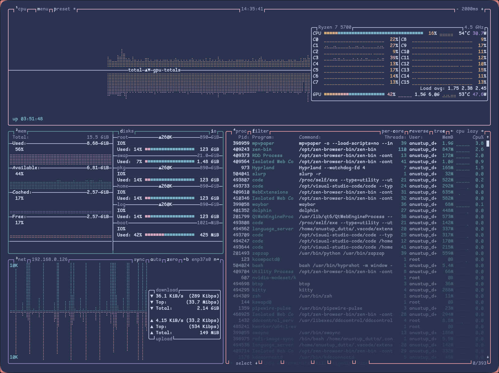
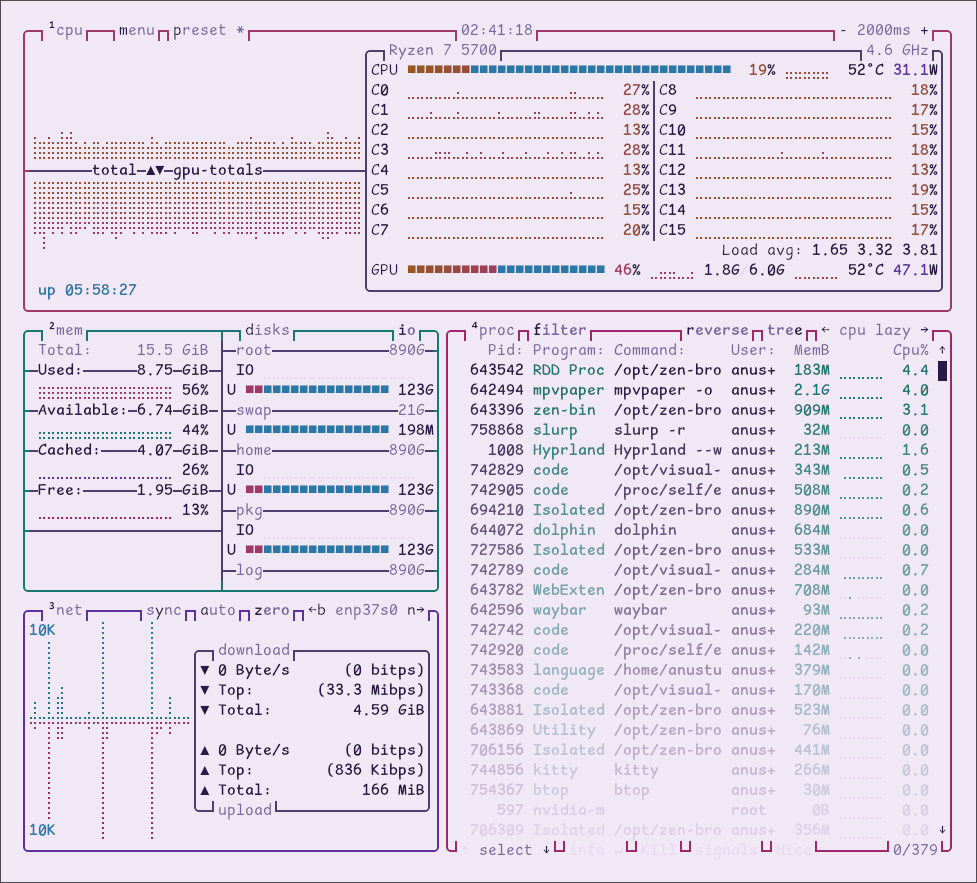

<div align="center">


# 夜桜 Yozakura — btop Theme

A handcrafted pastel color palette for [btop++](https://github.com/aristocratos/btop), based on the [Yozakura](https://github.com/shunsui18/yozakura) palette.

[](LICENSE)
[](https://github.com/aristocratos/btop)
[](install.sh)
[](https://github.com/shunsui18/yozakura)

</div>

---

## ✦ Flavors

| | Flavor | Description |
|---|---|---|
| 🌸 | **Yoru** *(night)* | Deep, moonlit background with soft sakura accents — default |
| ☀️ | **Hiru** *(day)* | Warm ivory canvas with gentle pastel tones |

<br>

<table>
<tr>
<td align="center"><b>🌸 Yoru</b></td>
<td align="center"><b>☀️ Hiru</b></td>
</tr>
<tr>
<td></td>
<td></td>
</tr>
</table>

---

## ✦ Installation

### Interactive — One-liner

Run without any arguments to launch the guided menu:

```bash
bash <(curl -fsSL https://raw.githubusercontent.com/shunsui18/btop/main/install.sh)
```

The installer will walk you through picking a flavor and background setting:

```
  夜桜 Yozakura — btop Theme Installer
  ──────────────────────────────────────

  Select a flavor:
  1) 🌸  Yoru  (night — deep moonlit background)
  2) ☀️   Hiru  (day  — warm ivory canvas)

  Flavor [1/2] (default: 1): _

  Use theme background?
  1) Yes  (theme_background = true)
  2) No   (theme_background = false — use terminal transparency)

  Background [1/2] (default: 1): _
```

---

### Non-interactive — Flags

Skip the menu entirely by passing flags directly:

```bash
bash <(curl -fsSL https://raw.githubusercontent.com/shunsui18/btop/main/install.sh) --theme hiru --bg false
```

| Flag | Values | Description |
|---|---|---|
| `--theme` | `yoru` \| `hiru` | Theme flavor to activate |
| `--bg` | `true` \| `false` | Set `theme_background` in btop.conf |
| `-h`, `--help` | — | Show help |

---

### Manual Installation

If you prefer to clone and run locally:

```bash
# 1. Clone the repo
git clone https://github.com/shunsui18/btop.git && cd btop

# 2a. Interactive
./install.sh

# 2b. Or with flags
./install.sh --theme hiru --bg false
```

---

## ✦ What the Installer Does

1. **Menu or flags** — launches an interactive prompt if no arguments are given, or skips straight to install when flags are provided
2. **Self-locates** — resolves its own path regardless of where it is called from or whether it is symlinked
3. **Validates** — confirms the requested theme file exists before touching anything
4. **Copies** all `yozakura-*.theme` files into `$HOME/.config/btop/themes/`, creating the directory if needed
5. **Patches** `$HOME/.config/btop/btop.conf`:
   - Sets `color_theme` to the full absolute path btop expects
   - Sets `theme_background` to your chosen value
   - Appends either key if it is missing from the config entirely
6. **Fails gracefully** — descriptive error messages if the config is missing, arguments are invalid, or a theme file is not found

> **Note:** btop must have been launched at least once so that `btop.conf` exists before running the installer.

---

## ✦ File Structure

```
btop/
├── assets/
│   ├── yozakura-yoru-btop-preview.png
│   └── yozakura-hiru-btop-preview.png
├── themes/
│   ├── yozakura-yoru.theme
│   └── yozakura-hiru.theme
├── install.sh
├── LICENSE
└── README.md
```

---

<div align="center">

crafted with 🌸 by [shunsui18](https://github.com/shunsui18)

</div>
